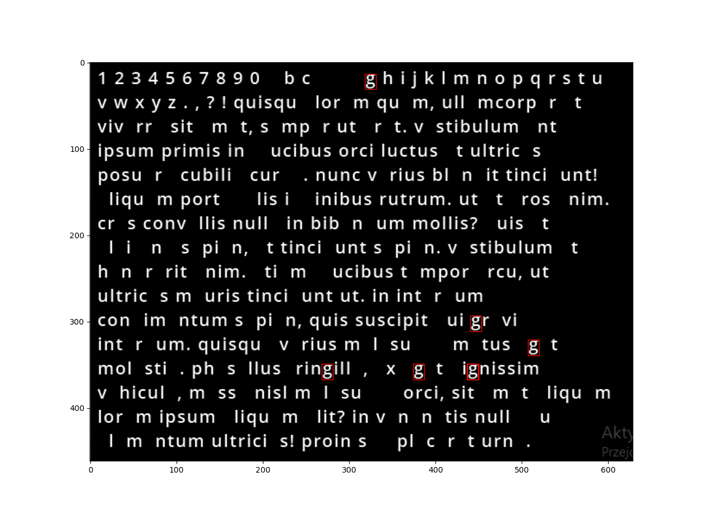
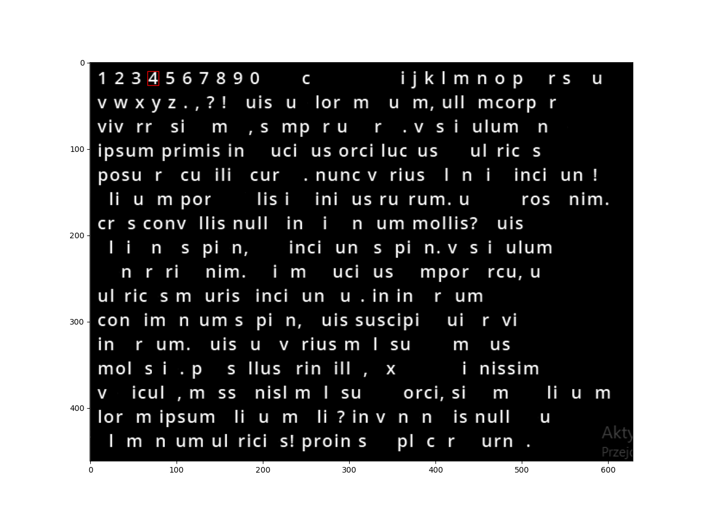

# Optical-character-recognition

Python console application that allows to extract text from document images using Discrete Fourier Transform and convolution.

## Showcase:

### Document image

### Program output

#### Scanned text
1 2 3 4 5 6 7 8 9 0 a b c d e f g h i j k l m n o p q r s t u v w x y z . , ? ! quisque lorem quam, ullamcorper et viverra sit amet, semper ut erat. 
vestibulum ante ipsum primis in faucibus orci luctus et uitrices posuere cubiiia curae. nunc varius biandit tincidunt! aliquam po,.ta feiis id finibus rutrum. 
ut et eros enim. cras convallis nulla in bibendum moilis? duis at eleifend sapien, et tincidunt sapien. vestibulum at hendrerit enim. etiam faucibus tempor arcu, 
ut ultrices mauris tincidunt ut. in interdum condimentum sapien, quis suscipit dui gravida interdum. quisque varius malesuada metus eget molestie. phaselius fringiiia,
 ex eget dignissim vehicula, massa nisl malesuada orci, sit amet aliquam lorem ipsum aliquam elit? in venenatis nulla eu elementum ultricies! proin sed placerat urna. 
 
#### Succes ratio
 

 
### Step by step showcase
 
 

 

 

 

 

 

 

 

 

 

 

 

 

 

 

 

 

 

 

 

 

 

 

 

 

 

 

 

 

 

 

 

 

 

 

 

 

 

 

 

